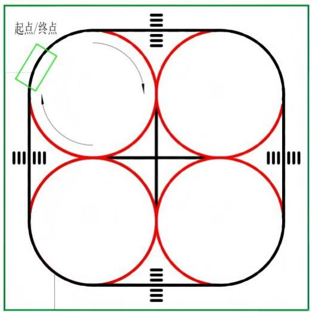
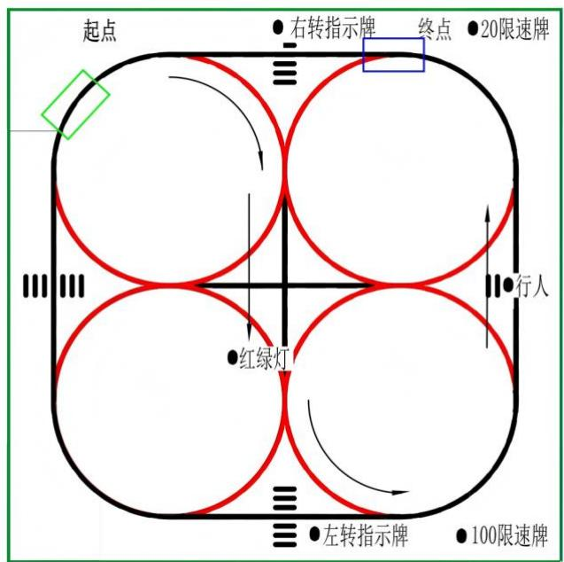

# 2026 年浙江省职工职业技能竞赛 人工智能训练师项目

实操竞赛试题（公布版） 

2026 年 4 月 

# 注意事项

1、比赛总时长为260分钟，包含裁判评判时间。开始实际操作比赛30分钟后，选手可 以弃赛，但不可提前离开赛位场地，需要在赛位指定位置，与比赛设备隔离。 

2、比赛共包括4个任务，总分100分，见表1。 

表1 实操比赛任务及配分

<table><tr><td>序号</td><td>名称</td><td>配分</td><td>说明</td></tr><tr><td>1</td><td>模块A:人工智能应用数据集制作</td><td>35</td><td></td></tr><tr><td>2</td><td>模块B:人工智能应用模型训练</td><td>25</td><td></td></tr><tr><td>3</td><td>模块C:智能自动驾驶场景综合应用</td><td>35</td><td></td></tr><tr><td>4</td><td>模块D:安全意识与职业素养</td><td>5</td><td></td></tr><tr><td colspan="2">合计</td><td>100</td><td></td></tr></table>

3、评判的节点在任务中有提示，需要裁判验收的各项任务，完成相应的任务后请示意 裁判进行评判，各项任务裁判只验收1次，请根据赛题说明，确认完成后再提请裁判验收。 

4、除有说明外，不限制各任务评判顺序，且不限制任务中各项子任务的先后顺序，完 成任务中任一子任务后，即可以举手示意裁判进行评判！选手在实际比赛过程中要根据赛 题情况进行操作。 

5、比赛过程中，选手一定要严格遵守安全操作规范，若发生危及设备或人身安全事故， 应立即停止比赛，取消其参赛资格。 

6、比赛所需要的资料及软件都以电子版形式保存在工位电脑桌面上。 

7、赛题中要求备份和保存在电脑中的文件，选手需在工位电脑桌面上建立结果存储 文件夹（命名方式为：AI+场次号+赛位号），例如结果存储文件夹名称为AI0102，其中， AI表示人工智能训练，01代表场次号，02代表赛位号。赛题中所要求存储的文件请备份到 结果存储文件夹下，即使选手没有任何存储文件也要求建立该文件夹。 

8、选手对比赛过程中需裁判确认部分，应当先举手示意。 

9、选手在竞赛过程中不得使用U盘，否则按作弊处理。 

10、选手在竞赛过程中应该遵守相关的规章制度和安全守则，如有违反，则按照相关 

规定在竞赛的总成绩中扣除相应分值。 

11、选手在比赛开始前，认真对照工具清单检查工位设备，确认后开始比赛；选手完 成任务后的检具、仪表和部件，现场需统一收回再提供给其他选手使用。 

12、选手严禁携带任何通讯、存储设备及技术资料，如有发现将取消其竞赛资格。选 手擅自离开本参赛队赛位或与其他赛位的选手交流或在赛场大声喧哗，严重影响赛场秩序， 如有发生，将取消其竞赛资格。 

13、选手必须认真填写各类文档，竞赛完成后包括实操任务书与评分表在内的所有文 档按页码顺序一并上交。 

14、选手必须及时保存自己编写的程序及材料，防止意外断电及其它情况造成程序或 资料的丢失。 

15、赛场提供的任何物品，不得带离赛场。 

16、为体现安全防护的要求，除特殊情况外，选手在比赛中需全程穿戴防滑劳保鞋。 

# 一、竞赛项目任务书

# （一）应用场景描述

本实操比赛模拟场景，假定选手的职业为人工智能训练师，正与一家自动驾驶企业紧密合 作，帮助他们应对技术挑战，合作开发出一款集高级驾驶辅助系统和部分自动化驾驶功能于一 体的汽车。选手需要与企业团队深入沟通，了解他们的目标、需求。帮助他们采集大量的交通 场景数据，并保证数据的多样性和代表性。在数据采集和准备阶段，与数据团队一同进行数据 标注和预处理。结合深度学习技术，精准识别和定位道路上的交通标志以及交通参与者。同时 协助企业团队将训练好的自动驾驶模型成功部署至车辆的控制“大脑”。并实现能够在多样化复 杂的环境下控制车辆的运行，从而提升通行效率，降低通行成本，且提高交通道路安全。 

请选手根据人工智能训练师的相关职业技能要求，结合自动驾驶的案例需求，完成人工智 能训练方案的部署、应用。 

参赛选手为该企业设计了详细的自动驾驶应用场景解决方案，表2为该应用场景的主要硬 件配置清单，表2为该应用场景的主要硬件配置清单。请参赛选手在进行部署和测试前，根据 安全规范要求和场景需求，逐一确认个人穿戴和赛位内各个设备的工况，完成表2内容的确认， 并规范填写。 

表2 自动驾驶应用场景硬件配置方案表

<table><tr><td>序号</td><td>平台</td><td>场景</td><td>设备名称</td><td>数量</td><td>单位</td><td>设备工况确认(良好打“√”,异常备注原因)</td></tr><tr><td>1</td><td rowspan="8">人工智能训练竞赛平台</td><td rowspan="7">演示场地</td><td>限速20交通标志</td><td>1</td><td>个</td><td></td></tr><tr><td>2</td><td>限速100交通标志</td><td>1</td><td>个</td><td></td></tr><tr><td>3</td><td>左转向交通标志</td><td>1</td><td>个</td><td></td></tr><tr><td>4</td><td>右转向交通标志</td><td>1</td><td>个</td><td></td></tr><tr><td>5</td><td>行人模型</td><td>1</td><td>个</td><td></td></tr><tr><td>6</td><td>可调红绿灯模型</td><td>1</td><td>套</td><td></td></tr><tr><td>7</td><td>人工智能自动驾驶应用场景</td><td>1</td><td>套</td><td></td></tr><tr><td>8</td><td>操作工位</td><td>人工智能标注、训练算法、部署及验证平台</td><td>1</td><td>套</td><td></td></tr></table>

# （二）具体工作任务

# 模块A：人工智能应用数据集制作

根据人工智能自动驾驶应用场景和所提供素材，完成竞赛平台的测试，在充分理解数据采 集、数据标注、数据集划分、数据增强及数据可视化的基础上，基于提供的软件环境，在规定 时间内完成规定格式数据集的制作，该数据集主要用于训练出一个能够识别出红绿灯模型、交 通标志模型、行人模型等物体的模型（权重）文件。 

# 任务A1. 人工智能标注、训练算法、部署及验证平台的配置与测试

根据任务要求，运用竞赛平台开发与测试工具，完成人工智能标注、训练及算法平台与人 工智能部署及验证平台的配置与测试。 

# 1、具体任务要求

（1）测试人工智能部署及验证平台运动单元、通过人工智能部署及验证平台现有的运动 驱动、键盘控制等功能接口函数和程序，使用键盘控制人工智能部署及验证平台实现实现前进、 后退、左转、右转等运动，具体要求见表3。 

（2）测试人工智能部署及验证平台感知单元、通过人工智能部署及验证平台现有的图像 获取、感知数据读取等功能接口函数和程序，分别获取头部摄像头和底部摄像头的实时图像画 面。 

（3）测试人工智能部署及验证平台交互单元、通过人工智能部署及验证平台现有的速度 控制、灯光驱动等功能接口函数和程序，实现以下2种灯光效果控制，且每种灯光显示时间不 能少于3秒： 

1）人工智能部署及验证平台左转时，左前、左后（共2个绿灯）连续闪烁； 

2）人工智能部署及验证平台右转时，右前、右后（共2个绿灯）连续闪烁。 

注意：将编写好的键盘控制的python程序和launch文件复制到“结果存储文件夹/A1” 

# 2、测试要求

（1）要求在裁判评判时，选手按照表 3 顺序按下对应键盘键位，人工智能部署及验证平 台执行对应运动动作。 

表 3 人工智能部署及验证平台运动动作-键盘键位对照表 

<table><tr><td>序号</td><td>人工智能部署及验证平台底盘运动</td><td>对应键盘键位</td></tr><tr><td>1</td><td>按住键盘键位,平台左转,松开后停止</td><td>A</td></tr><tr><td>2</td><td>按住键盘键位,平台右转,松开后停止</td><td>D</td></tr><tr><td>3</td><td>按住键盘键位,平台前进,松开后停止</td><td>W</td></tr><tr><td>4</td><td>按住键盘键位,平台后退,松开后停止</td><td>S</td></tr></table>

（2）要求在裁判评判时，选手在人工智能标注、训练及算法平台上展示人工智能部署及验 证平台头部摄像头和底部摄像头的实时图像画面。 

（3）要求在裁判评判时，选手依次展示 4 种灯光效果控制，且每种灯光显示时间不能少 于 3 秒： 

①人工智能部署及验证平台左转时，左前、左后（共 2 个绿灯）连续闪烁； 

②人工智能部署及验证平台右转时，右前、右后（共2个绿灯）连续闪烁。 

# 任务A2.人工智能应用数据集采集与清洗

根据任务要求，基于真实道路环境的图片素材、仿真视频素材、人工智能自动驾驶应用场 景，使用相应的软件编程测试完成要求数量张数的图像采集与清洗。 

# 1、具体任务要求

（1）基于真实道路环境的仿真图片素材、视频素材、人工智能自动驾驶应用场景，根据识 别任务要求，编写图像采集程序，采集红灯、黄灯、绿灯、限速20标志、限速100标志、左转 向标志、右转向标志、行人模型等高质量图像，并对图像进行清洗，剔除不符合要求的图像， 最终获得至少 400 张高质量图片并编写或修改重命名程序（rename.py），按照规范给照片命名 （命名规则如下：AI0001.jpg、AI0003.jpg、AI0005.jpg、AI0007.jpg……按奇数序号重命名每张 图片,png 文件名为 AI0001.png 但文件名必须遵循规律）。 

（2）编写相关程序，通过可视化开发环境对清洗后的图像进行数据可视化（分类统计柱状 图），具体要求如下： 

1）柱状图横坐标为类别，纵坐标为数量 

2）在每个类别柱子的底部显示该类别的名称 

3）在每个类别柱子的顶部显示该类别的数量。 

注意：将清洗后的图像复制到“结果存储文件夹/A2/图像清洗”；将图像分类统计柱状图及 程序复制到“结果存储文件夹/A2”；将重命名程序（rename.py）复制到“结果存储文件夹/A2”。 

# 2、测试要求

（1）要求在裁判评判时，选手展示“结果存储文件夹/A2/图像清洗”文件夹中红灯、黄灯、 绿灯、限速20标志、限速100标志、左转向标志、右转向标志、行人模型的图像，并展示文件 夹中图片总数量（应不少于400张）。 

（2）要求在裁判评判时，选手运行程序生成图像分类统计图。 

# 任务A3.图像数据集标注

根据任务要求，使用提供的标注软件，按照要求对清洗后的图像完成相关类别的标注，输 出标注数据，可视化标注内容，制作不同格式的数据集（VOC、COCO、YOLO 等）并对数据 集进行划分，将数据集按照不同的要求进行可视化编程（拼接图等）。 

# 1、具体任务要求

（1）上传清洗后的图片至人机协同数据标注平台，完成图像中红灯、黄灯、绿灯、限速 20 标志、限速 100 标志、向左转弯标志、向右转弯标志、行人等目标的标注。标注类别命名及顺 序如下： 

表4 标注类别命名及顺序

<table><tr><td>类别序号</td><td>类别名称</td></tr><tr><td>0</td><td>person</td></tr><tr><td>1</td><td>turn_left</td></tr><tr><td>2</td><td>turn_right</td></tr><tr><td>3</td><td>limit_20</td></tr><tr><td>4</td><td>limit_100</td></tr><tr><td>5</td><td>red_light</td></tr><tr><td>6</td><td>yellow_light</td></tr><tr><td>7</td><td>green_light</td></tr></table>

（2）编写相关程序，通过可视化开发环境对标注后的数据集进行图像拼接可视化，要求按 横向 10 列、纵向 10 行进行拼接（每张拼接图包含100张标注图片，每张标注图片中需正确 显示标注框与标注类别名称）。 

（3）编写相关程序，通过可视化开发环境对标注后的数据集进行训练集、验证集及测试集 按7：2：1划分，制作成规定格式的数据集。 

注意：将标注后的图像数据集复制到“结果存储文件夹/A3/图像数据标注”；将类别标签文 件 class.txt 复制到“结果存储文件夹/A3”；将标注画面拼接效果图及程序复制到“结果存储文件 夹/A3”； 将训练集、验证集、测试集文件及数据集划分程序复制到“结果存储文件夹/A3/图像 

数据集划分”。 

# 2、测试要求

（1）要求在裁判评判时，选手在标注软件中分别展示红灯、黄灯、绿灯、限速 20 标志、 限速 100 标志、左转向标志、右转向标志、行人模型等目标的标注画面，并展示类别标签文件 classes.txt。 

（2）要求在裁判评判时，选手在可视化开发环境中展示所有图像标注画面拼接后的效果 图。 

（3）要求在裁判评判时，选手展示训练集、验证集及测试集的划分比例及具体划分情况。 

# 任务A4.文本数据集标注

根据任务要求，使用提供的标注软件，按照要求对素材库中文本数据完成相关类别的标注， 制作不同格式的数据集,,对数据集进行划分。 

# 1、具体任务要求

（1）按照要求对素材库中文本数据进行标注，完成咨询、投诉、报修等语义标注，总标注 数量不少于200条。标注类别命名及顺序如下： 

表5 标注类别命名及顺序

<table><tr><td>类别序号</td><td>类别名称</td></tr><tr><td>0</td><td>咨询</td></tr><tr><td>1</td><td>投诉</td></tr><tr><td>2</td><td>报修</td></tr></table>

（2）编写相关程序，通过可视化开发环境对标注后的数据集进行训练集、验证集及测试集 按8：1：1划分，制作成规定格式的数据集。 

注意：将标注后的文本数据集复制到“结果存储文件夹/A4/文本数据标注”； 将训练集、验 证集、测试集文件及数据集划分程序复制到“结果存储文件夹/A4/文本数据集划分”。 

# 2、测试要求

（1）要求在裁判评判时，选手在标注软件中分别展示咨询、投诉、报修等语义标注等语义 的标注画面。 

（2）要求在裁判评判时，选手展示训练集、验证集、测试集的划分比例及具体划分情况。 

# 模块B：人工智能应用模型训练

根据模块A中制作的规定格式数据集，在充分理解网络重构、参数调优、模型训练、模型 验证及模型评估的基础上，基于提供的软件环境，在规定时间内训练出一个能以较高的准确率 对未知图像和文本进行检测和分类的模型。 

# 任务B1.图像模型训练

根据提供的模型训练算法环境（如人工智能算法平台、模型训练算法软件等），导入制作 的数据集，按要求选择指定模型，通过模型的参数调节，完成模型训练，并展示模型训练过程 中评估指标的变化情况。 

# 1、具体任务要求

基于提供的人工智能算法平台，导入模块A中制作的规定格式数据集。根据数据集的数据 特点，在人工智能算法平台完成模型训练，并生成相应训练成绩，训练成绩应包括训练图像数 量、标签类别、instances、精确率、召回率、mAP50、mAP50-95等训练评估指标参数。 

执行相关测试指令，使用生成的模型对未知测试数据集进行图片验证 

执行相关测试指令，使用生成的模型对素材库中的视频进行视频验证，并对验证后的视频 结果进行保存。 

注意：将生成的模型文件复制到“结果存储文件夹/B1”；将图片测试结果文件复制到“结果 存储文件夹/B1”；将视频测试结果文件复制到“结果存储文件夹/B1”。 

# 2、测试要求

（1）要求在裁判评判时，选手在人工智能算法平台上用val命令在终端展示模型训练完成 后生成的训练成绩：训练图像数量、标签类别、instances、精确率、召回率、mAP50、mAP50- 95等训练评估指标参数。 

（2）要求在裁判评判时，选手向裁判申请测试数据集，并在 5 分钟内验证图片测试结果 并展示相应模型评估指标。 

（3）要求在裁判评判时，选手展示视频验证的结果文件。 

# 任务B2.文本模型训练

根据提供的模型训练算法环境（如人工智能算法平台、模型训练算法软件等），导入制作 的文本数据集，按要求选择指定模型，通过模型的参数调节，完成模型训练，并展示模型训练 过程中评估指标的变化情况。 

# 1、具体任务要求

基于提供的人工智能算法平台，导入模块 A 中制作的规定格式文本数据集。根据数据集 的数据特点，配置预训练模型（bert-base-chinese）、模型训练参数，在人工智能算法平台完成 模型训练，并生成相应训练成绩，训练成绩应包括训练文本数量、标签类别、训练轮数、样本 量、训练验证集划分比例、精确率、召回率、F1 值、准确率等训练评估指标参数。 

# 2、测试要求

要求在裁判评判时，选手在人工智能算法平台上用文本模型验证指令在终端展示模型训练 完成后生成的训练成绩：训练文本数量、标签类别、样本实例数、精确率、召回率、F1 值、准 确率等训练评估指标参数。 

要求在裁判评判时，选手向裁判申请文本测试数据集，并在 5 分钟内验证文本语义测试结 果。 

# 模块C：智能自动驾驶场景综合应用

根据任务要求，将经过充分训练的智能驾驶模型成功部署到指定的人工智能部署及验证平 台。该模型将通过综合感知和分析，以实时、高效的方式进行各种路况的智能识别和分析，包 括但不限于红绿灯状态识别、道路转向判断、交通标志辨识等复杂的自动驾驶任务。 

# 任务C1.模型部署验证

根据任务要求，基于提供的文件传输和编辑平台，通过环境配置和模型部署，使得模型可 适配指定硬件架构的人工智能部署及验证平台，通过编程调试，结合不同的灯光显示、语音播 放、界面交互等，实现人工智能部署及验证平台对不同目标对象的自主检测功能。 

# 1、具体任务要求

基于生成的模型，编写人工智能部署及验证平台智能自动驾驶场景应用接口程序及相关逻 辑，实现人工智能部署及验证平台对实体红绿灯模型和实体转向牌模型的识别，同时做出对应 的动作。 

注意：将编写好的python程序和launch文件复制到“结果存储文件夹/C1” 

# 2、测试要求

要求在裁判评判时，选手将人工智能部署及验证平台置于操作工位桌面调试架上，将实体 红绿灯模型和实体转向牌模型依次放置到平台前方适当位置，展示识别情况，同时人工智能部 署及验证平台能够根据识别任务要求完成相应自动驾驶动作。 

展示要求如下： 

① 识别到红灯，人工智能部署及验证平台速度为 0，前后红灯（共4个红灯）连续闪烁； 

② 识别到黄灯，人工智能部署及验证平台减速至极低速度（轮子缓慢移动，不能为 0）， 前后黄灯（共4个黄灯）连续闪烁； 

③ 识别到绿灯，人工智能部署及验证平台保持常速，前后绿灯常亮； 

④ 识别到左转向标志，人工智能部署及验证平台进行左转，前后左侧绿灯（共2个绿灯） 连续闪烁； 

⑤ 识别到右转向标志，人工智能部署及验证平台进行右转，前后右侧绿灯（共 2 个绿灯） 连续闪烁 

# 任务C2.车道线检测功能测试

根据任务要求，基于人工智能自动驾驶应用场景，通过编程调试，结合不同的灯光显示、 界面交互等，实现人工智能部署及验证平台对应用场景中车道线的检测功能。 

# 1、具体任务要求

编写人工智能部署及验证平台智能自动驾驶场景应用接口程序、界面交互及车道线检测功 能逻辑，实现人工智能部署及验证平台的车道线自适应巡航功能。 

注意：将编写好的python程序和launch文件复制到“结果存储文件夹/C2” 

# 2、测试要求

要求在裁判评判时，选手展示车道线检测任务，人工智能部署及验证平台从人工智能自动 驾驶应用场景起点出发，执行车道线自适应巡航功能，直至巡航至人工智能自动驾驶应用场景 终点，即完成一圈车道线自适应巡航功能，且人工智能部署及验证平台运行全程不得跑出车道 线范围之外。参考起终点设置见图1。 

图1 测试平台模拟车道 

评判标准：车道线在4个车轮中间（含轮子压在车道线上）为合格，任1车轮超出车道线 计不合格1次。 

# 任务C3.基于第一视角的综合功能测试

根据任务要求，基于提供的真实道路环境仿真视频素材和智能自动驾驶场景应用接口程序， 通过对人工智能部署及验证平台的配置、编程与调试，结合灯光系统、语音播报系统、界面交 互等功能，通过不同的灯光显示、界面交互等方式，实现对仿真视频素材中道路环境的自主检 测，并做出相应的动作，完成智能自动驾驶场景综合应用。 

# 1、具体任务要求

将智能驾驶模型部署到人工智能部署及验证平台，编写人工智能部署及验证平台智能自动 驾驶场景应用接口程序及控制逻辑，实现对仿真视频素材中自动驾驶场景车道线、相关交通标 志以及应用场景的检测，完成人工智能部署及验证平台基于仿真视频内容的自适应巡航及目标 检测功能，同时运行相应动作。 

注意：将编写好的 python 程序和 launch 文件复制到“结果存储文件夹/C3” 

# 2、测试要求

要求在裁判评判时，选手展示人工智能部署及验证平台基于仿真视频素材进行车道线自适 应巡航、目标检测、智能自动驾驶。 

智能自动驾驶动作要求： 

人工智能部署及验证平台置于操作工位桌面调试架上 

识别到红灯，人工智能部署及验证平台速度为0，前后红灯（共4个红灯）连续闪烁 

识别到黄灯，人工智能部署及验证平台减速至极低速度（轮子缓慢移动，不能为 0），前 后黄灯（共4个黄灯）连续闪烁 

识别到绿灯，人工智能部署及验证平台保持常速，前后绿灯常亮 

识别到左转向标志，人工智能部署及验证平台进行左转，前后左侧绿灯（共2个绿灯）连 续闪烁 

识别到右转向标志，人工智能部署及验证平台进行右转，前后右侧绿灯（共2个绿灯）连 续闪烁 

识别到限速100标志，人工智能部署及验证平台加速，播报语音“请注意，车辆加速中” 

识别到限速20标志，人工智能部署及验证平台减速，播报语音“请注意，车辆减速中” 

# 任务C4.基于第三视角的综合功能测试

根据任务要求，基于人工智能自动驾驶应用场景和智能自动驾驶场景应用接口程序，通过 配置、编程与调试，结合灯光系统、界面交互等功能，通过不同的灯光显示、界面交互等方式， 完成规定场景下道路路况的识别，并根据识别结果，控制人工智能部署及验证平台做出相应的 动作，实现智能自动驾驶场景综合应用。 

# 1、具体任务要求

将智能驾驶模型部署到人工智能部署及验证平台，编写人工智能部署及验证平台智能自动 驾驶场景应用接口程序、界面交互及控制逻辑，实现对人工智能自动驾驶应用场景下车道线、 行人模型等相关交通标志的检测，完成人工智能部署及验证平台基于人工智能自动驾驶应用场 景的自适应巡航及目标检测功能，同时运行相应动作，人工智能部署及验证平台运行全程不得 跑出车道线范围之外。参考起终点设置见图2。 

注意：将编写好的python程序和launch文件复制到“结果存储文件夹/C4” 

图2 测试平台模拟车道

# 2、测试要求

要求在裁判评判时，选手启动人工智能部署及验证平台，启动后除了试题规定动作外，全 程不得人工干预，否则立即停止评判。具体测试要求如下： 

① 选手手动设置交通信号灯为红灯 

② 通过指令启动人工智能部署及验证平台，以初始0.2的速度前行 

③ 当检测到右转标志时，人工智能部署及验证平台进行右转，前后右侧绿灯（共 2 个绿 

灯）连续闪烁，随后继续沿车道线行驶 

④ 当检测到红灯时，人工智能驾驶应用平台的前后共 4 个红灯闪烁，速度为 0，并播报语 音“识别到红灯，停车” 

⑤选手手动设置交通信号灯为黄灯 

⑥ 当检测到黄灯时，人工智能驾驶应用平台的前后共4个黄灯闪烁，减速至极低速度（轮 子缓慢移动，不能为0），并播报语音“识别到黄灯，车辆减速” 

⑦ 选手手动设置交通信号灯为绿灯 

⑧当检测到绿灯时，人工智能驾驶应用平台的前后共 4 个绿灯常亮，以 0.2 的速度前行， 并播报语音“识别到绿灯，正式行驶” 

⑨当检测到左转标志时，人工智能部署及验证平台进行左转，前后左侧绿灯（共 2 个绿灯） 连续闪烁，随后继续沿车道线行驶，并播报语音“识别到左转，车辆左转弯” 

⑩当检测到限速100标识牌时，人工智能部署及验证平台加速，以0.5的速度前行，播报 语音“请注意，车辆加速中” 

⑪当检测到行人时，速度为0，车头在距离行人10-15cm之间的位置停车，人工智能驾驶 应用平台的前后共4个黄灯和4个红灯交替闪烁，并播报语音“识别到行人，停车” 

⑫选手手动移走行人，当检测到 20 限速牌时，人工智能部署及验证平台减速，播报语音 “请注意，车辆减速中”，车辆继续沿车道线行驶，直至到达终点 

# 模块D：安全意识与职业素养

根据任务要求，严格按照操作规程和工艺准则，遵守安全操作要求，各参赛队要发扬良好 道德风尚，听从指挥，服从裁判，不弄虚作假。 

# 具体任务要求：

（1）严格遵循相关职业素养要求及安全规范；文明参赛、保持安全意识。 

（2）开始操作前应认真检查各个设备急停开关是否有效。 

（3）及时为设备充电，防止设备因电量过低而自动下电。 

（4）规范使用及操作设备，比赛过程中，未损坏任何设备；若设备、工具、仪器跌落，应 及时放置于安全位置；比赛完成后，将设备、工具、仪器恢复至原位。 

# 二、竞赛结束时当场提交的成果与资料

竞赛结束时，参赛队须当场提交成果与资料： 

（一）结果存储文件夹备份至大赛提供的指定存储设备中，封装后签上场次和赛位号，并 上交裁判。 

（二）实操任务书与评分表一并上交。 

# 三、实操竞赛试题公布说明

本次公布的竞赛试题为 1.0 版本。在正式比赛前，还可能根据场地、设备情况对赛题进行 微调和细化，但不会有大的调整。如果有相关调整或者其他需要公布的内容，组委会将及时告 知选手。 